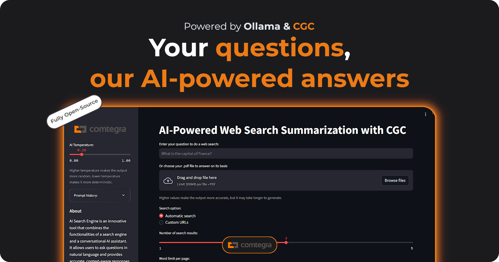
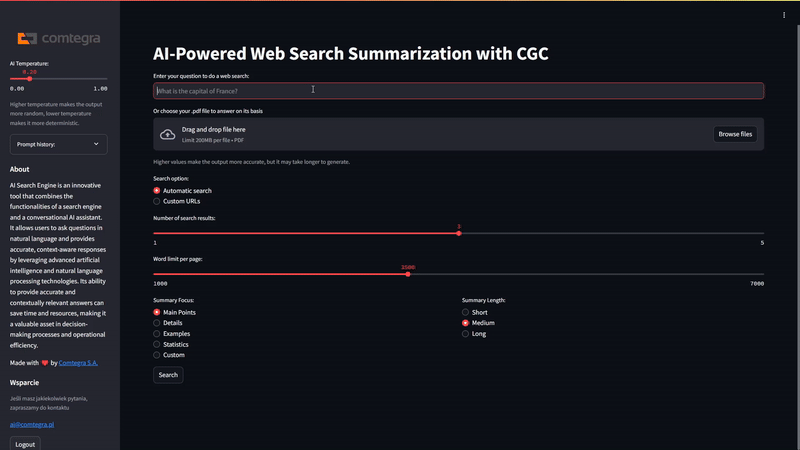

# AI-Powered Web Search and Summarization with CGC

A simple Open-Source Perplexity AI clone. Made with ❤️ by [Comtegra S.A.](https://comtegra.pl/)

## Overview

This application leverages Large Language Models (LLMs) combined with web search capabilities to efficiently retrieve and summarize information. Users can input questions in natural language and receive detailed, customizable summaries based on real-time web search results or uploaded PDF files. Utilizing advanced AI technology, including models such as [SpeakLeash/bielik-11b-v2.2-instruct:Q8_0](https://ollama.com/SpeakLeash/bielik-11b-v2.2-instruct:Q8_0), the app delivers context-aware responses and maintains transparency regarding its information sources.


## Features

- AI-powered web search
- Intelligent summarization with fully customizable length and focus
- PDF document summarization
- Query history with timestamps
- Multilingual support (responses in the same language as the query)
- Flexible AI model selection (compatible with models supported by Ollama)
- Related questions generation
- Source transparency
- User authentication

## Tech Stack

- **Frontend**: Streamlit
- **Backend**: Python
- **AI Models**: 
  - Large Language Models (LLMs) via Ollama (e.g., bielik-11b-v2.2-instruct)
- **Natural Language Processing**: Ollama
- **Web Scraping**: BeautifulSoup
- **Search Engine Integration**: Google Search API
- **Language Detection**: Langdetect
- **PDF Processing**: pdf2md
- **GPU**: NVIDIA A5000

## Demo



## Setup CGC Environment

This application can be deployed and run on [Comtegra GPU Cloud (CGC)](https://cgc.comtegra.cloud/) for improved accessibility and scalability. CGC provides a robust and secure environment optimized for AI-powered applications like this one.

For optimal performance, an NVIDIA A100 GPU is recommended. However, the A5000 GPU is also capable of handling this task efficiently. Selecting the appropriate GPU is crucial for achieving the best price-to-performance ratio.

For this project, we set up a PyTorch environment using an A5000 GPU and a 30GB mounted volume.

```bash
cgc volume create your_volume -s 30

cgc compute create --name <name> -c 6 -m 24 -g 1 -gt A5000 -v data_volume nvidia-pytorch
```

## Installation

After you set up your CGC Environment.

1. Clone the repository:
   ```bash
   git clone https://github.com/Comtegra/llm-search
   cd llm-search
   ```

2. Install required dependencies and set up Ollama:

   Use the provided Jupyter notebook
   - **Run the** `softstack.ipynb` file, which will install all necessary dependencies and install Ollama.

3. Set up Ollama:
   - After installation, start the Ollama service:
     ```
     ollama serve
     ```
   - Pull desired models:
     ```
     ollama pull SpeakLeash/bielik-11b-v2.2-instruct:Q8_0
     ```

>**Note**: Models must be pulled in a different terminal window than the one running `ollama serve`. Ensure that Ollama is running (`ollama serve`) in a separate terminal window before starting the Streamlit app for proper functionality. 


## Usage

1. Start the Streamlit app:
   ```
   streamlit run app/app.py --server.port <your_open_port> --server.baseUrlPath=/<your_base_path>
   ```
   > The `--server.baseUrlPath=/<your_base_path>` option accounts for the URL structure provided by CGC (Comtegra GPU Cloud). This configuration ensures that Streamlit correctly handles requests when accessed through the CGC URL (e.g., `https://resource-name.namespace.region.comtegra.cloud/<your_base_path>`).

2. Open your web browser and navigate to the URL you provided to Streamlit (usually https://resource-name.namespace.region.comtegra.cloud/<your_base_path>).

   > **Note**: The `/<your_base_path>` is included because we set it as the base URL path in step 1 using the `--server.baseUrlPath=/<your_base_path>` option. Replace `<your_base_path>` with whatever path you choose to use.

3. Log in to the application:
   - For this example, use the following credentials:
     (Note: These credentials can be changed or new profiles can be added in the secret.yaml file)
     - Username: test
     - Password: test

4. In the main input field, enter your question or topic of interest.

5. Alternatively, upload a PDF file to summarize its contents.

6. Adjust the search and summarization settings as needed:
   - Use the slider to set the number of search results and word limit for web searches
   - For PDF files, use the slider to set the word limit per file
   - Choose the summary length and focus using the radio buttons, or set your own custom focus
   - Adjust the temperature in the sidebar
   > **Note**: Increasing the number of pages and words per page will generally result in more accurate and comprehensive output, but may also increase processing time.

7. Click the "Search" button to generate results and related questions.

8. Review the summary, sources, and related questions provided by the app.

9. To view your query history, check the "user_prompt.txt" file, which logs all queries with timestamps or look at the left side of the screen, where you'll find an expander containing your prompt history.

10. To start a new search, simply enter a new question or upload a new PDF file and repeat the process.

For a more detailed tutorial and potential troubleshooting, please refer to the [UseCase.md](UseCase.md) file.

## Possible Future Improvements

- Integration with additional search engines
- Fine-tune your own model to use for answer synthesis
- Enhanced error handling and user feedback
- Create an intelligent "follow-up" system for deeper, context-aware exploration
- Improved caching for faster repeated queries

The sky's the limit! With [CGC (Comtegra GPU Cloud)](https://cgc.comtegra.cloud/), we're only capped by our imagination. From AI-powered holographic interfaces to quantum-entangled search algorithms, the possibilities are endless. Dream big and code bigger! 😉

## Support

- For questions or support, please contact: ai@comtegra.pl
- Visit our [documentation](https://docs.cgc.comtegra.cloud/) for more detailed information

## License

This project is licensed under the Apache License 2.0. See the [LICENSE](LICENSE.md) file for details.

## About [Comtegra S.A.](https://comtegra.pl/)
Comtegra is an IT systems integrator based in Poland, specializing in various aspects of information technology, including data storage and management, information security, and network construction. Founded in 1999, Comtegra has established itself as a significant player in the Polish IT market, providing services such as backup solutions, cybersecurity, and virtualization technologies. The company emphasizes the integration of artificial intelligence within business operations to enhance data management and decision-making processes.